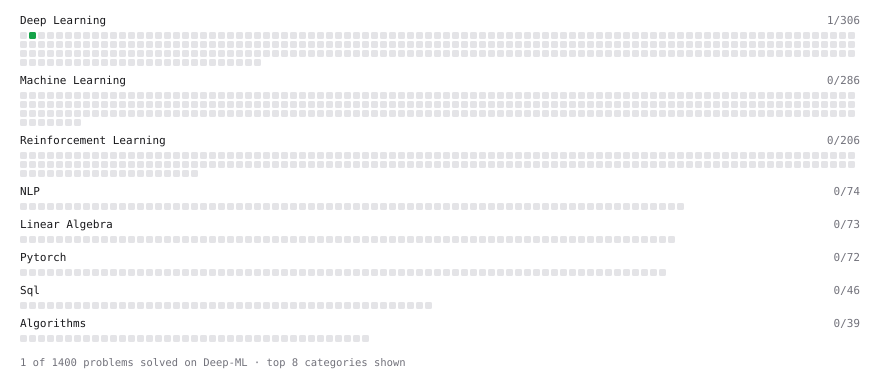

# Deep-ML

My machine learning practice from [Deep-ML](https://www.deep-ml.com). Every solution here was written by hand.

**1** solved · 0 problems · 0 labs · 1 math

[**Browse the interactive portfolio**](https://nATINDERdEEP.github.io/deep-ml/) to replay this filling in over time.

## Math

| | Difficulty | Solved | |
| --- | --- | --- | --- |
| [Softmax and Cross-Entropy](https://www.deep-ml.com/math-problems/32) | medium | 2026-09-16 | [solution](math/0032-softmax-and-cross-entropy) |

---

_This file is regenerated by Deep-ML on every push._
